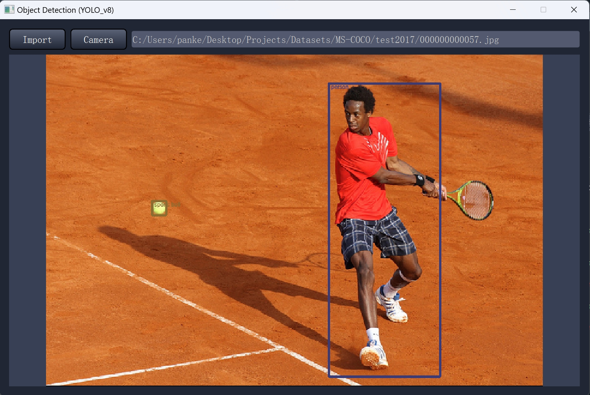

# Object Detection with YOLOv8 and PyTorch

This project aims to perform Object Detection using YOLOv8 with the PyTorch MS-COCO dataset (GUI included).


### Dataset: 
[MS-COCO](https://cocodataset.org/#download)


### Build: 

	CPU: Intel i9-13900H (14 cores)
	GPU: NVIDIA RTX 4060 (VRAM 8 GB)
	RAM: 32 GB


### Python Packages:

	conda install pytorch==2.1.2 torchvision==0.16.2 torchaudio==2.1.2 pytorch-cuda=12.1 -c pytorch -c nvidia
	conda install -c conda-forge opencv==4.6.0
	conda install -c conda-forge lightning==2.3.2
	conda install -c conda-forge albumentations==1.3.1
	conda install -c conda-forge pycocotools==2.0.8

### Code Structure:
```bash
├── GUI.py (Run to generate GUI)
├── main.py (Run to train model)
├── dataset.py
├── qt_main.ui
├── training.py
├── visualization.py
├── class_ind_pair.pkl
├── nets
    ├── nn.py
    ├── summary.py
```

### Dataset Structure:
```bash
├── MS-COCO
    ├── annotations_test2017
        ├── image_info_test2017.json
        ├── image_info_test-dev2017.json
    ├── annotations_trainval2017
        ├── captions_train2017.json
        ├── captions_val2017.json
        ├── instances_train2017.json
        ├── instances_val2017.json
        ├── person_keypoints_train2017.json
        ├── person_keypoints_val2017.json
    ├── test2017
        ├── 000000000001.jpg
        ├── 000000000002.jpg
    ├── train2017
        ├── 000000000001.jpg
        ├── 000000000002.jpg
    ├── val2017
        ├── 000000000001.jpg
        ├── 000000000002.jpg
```

### Credits:

	https://github.com/jahongir7174/YOLOv8-pt
	https://github.com/ultralytics/ultralytics


	